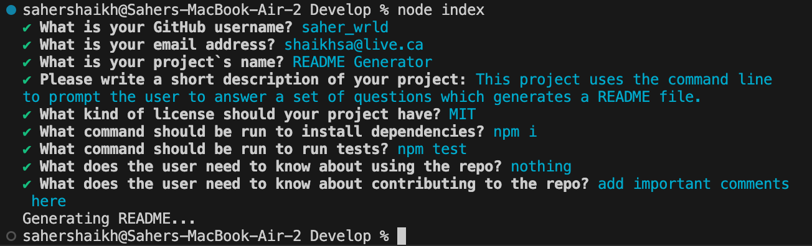

# README Generator 


## Description
Having a high-quality README is essential when launching an open-source project. It should clearly explain the purpose of the app, provide usage instructions, outline installation steps, describe how to report issues, and guide potential contributors on how to get involved. Including a section on contributions is particularly important, as it encourages other developers to help make the project more successful. 

In this challenge, you'll create a command-line took that simplifies the process of generating a README file. By using this tool, project creators can quickly produce a professional READNE file, allowing them to focus more on developing the project itself. 

Your task is to build a command-line application that uses the Inquirer package to dynamically generate a README.md file based on user input.

The application can be run with the following command:

```bash
node index.js
```

## Technologies Used 
- JavaScript
- Node.js

## Instructions
Use the command provided above (node index.js). The terminal will prompt the uerr a series of questions about their project to generate a professional README. 




## Links

* [GitHub Repository](https://github.com/saher-wrld/challange-07)
* [Video Generating](https://drive.google.com/file/d/1ezPwPbMdMUjY7lAqfo6H5tr-L_3MgBX5/view)
* [Video Links](https://drive.google.com/file/d/1E7Hv1uAfIGLvLSeQVYsMLDAb5GC1W2jJ/view)
  

